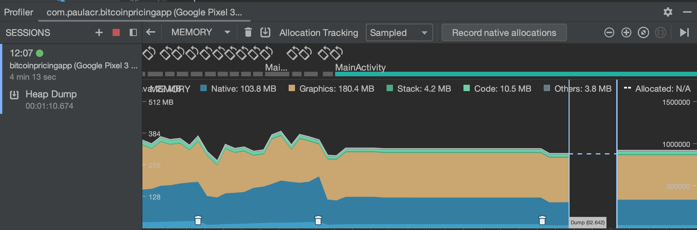

# BitcoinPricingApp
* Requirements: min sdk version: 28

## Architecture
* MVVM
* Multimodule to separate:
  - App
  - Data
  - Domain
  - Graph Builder
  - Use cases to be between repository and view model

## Dependency Injection
* Dagger
* Each module contains a class to provide the depedencies

## Mapper
* Converts the Api raw data to Specific object (Price of bitcoin)
* Apply validators / transformations on the data

## View Binding
* Used to provide access to the layout views

## RxJava with Retrofit and Okhttp
* Used to perform 

## App behavior
* Try to get data from cache at the first time (when the app is launched)
* Show the data
* Schedule a recurring api call for getting bitcoin price and update the graph
* Only call invalidate when the graph is already created
* Api errors are not visible to the user, since is a reeschduled call
* The label on top of the graphic will show the time of the last update
* Each time that the data is refreshed the cache is updated with the new data

## Performance
The profiling tools didn't show any apparent problems in retaning objects

### Future improvements

## Features
* Add month filters to show a graph for specific month
* Create a user settings
* Work with local notifications
* Integrate with Calendar, spread sheet, and other libraries

## Codebase
* Create more tests (and improve the mocks)
* Create instrumented tests
* Create a module for common dependencies
* Improve dagger modules (need to study a better separation)
* Add kotlin detekt
* Add library findBugs
* Add library canary leak
* Refactor the RxJava stream for re-scheduling

## Repository
* add badge for check CI status

